# Project 명 

## 1. 로그인

로그인은 간단하게 ID, PW 입력을 통해 DB를 확인하여 로그인을 진행

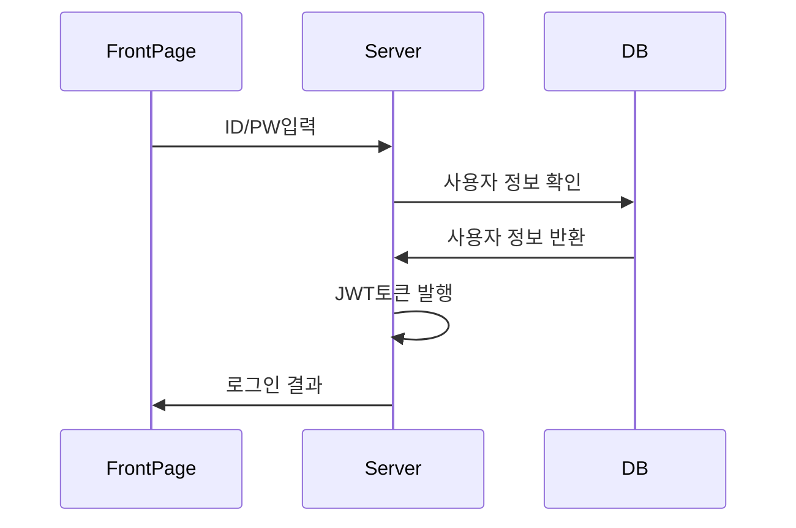

## 2. 회원 가입

회원가입에 성공하면 DB에 해당 정보를 저장한다. 

#### 인증 성공의 경우

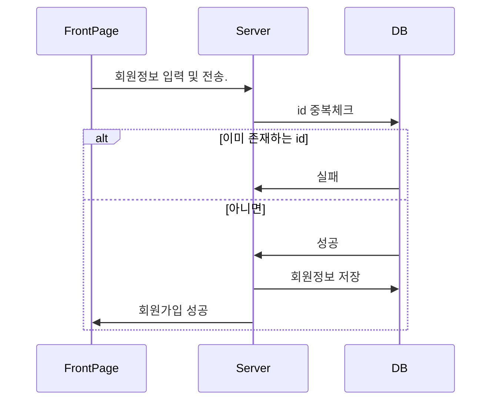

## 3. 회원 정보 수정

사용자가 원하는 정보를 수정한다.

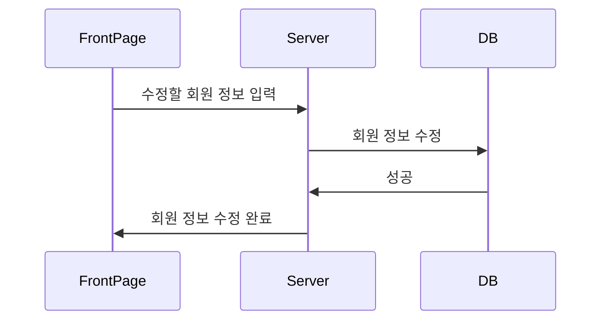

## 4. 스터디 방 입장

사용자가 스터디 방에 입장한다.

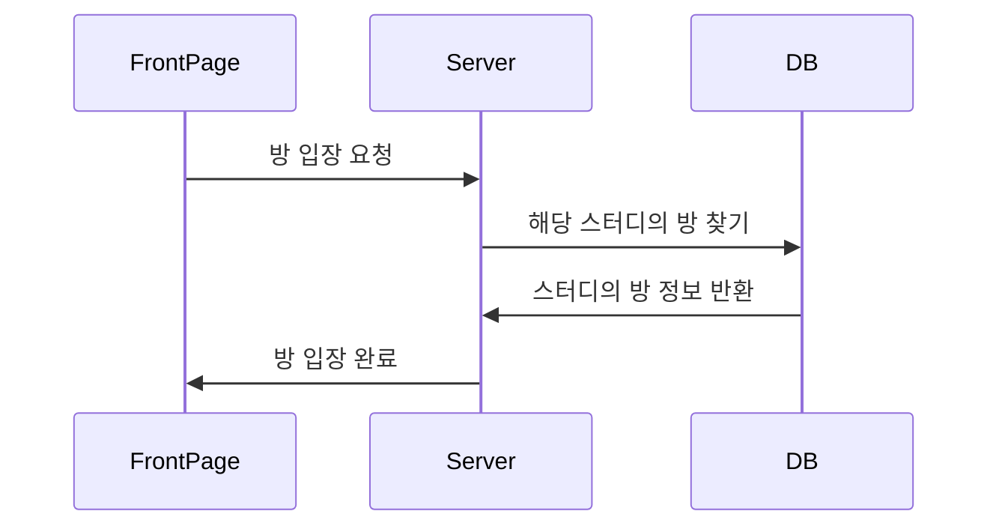

## 5. 스터디 방 정보 보기

스터디 방 입장 후 스터디 정보를 확인한다.

## 6. 스터디 방 참가자 보기

스터디 방 입장 후 현재 방에 들어와있는 참가자를 확인한다.

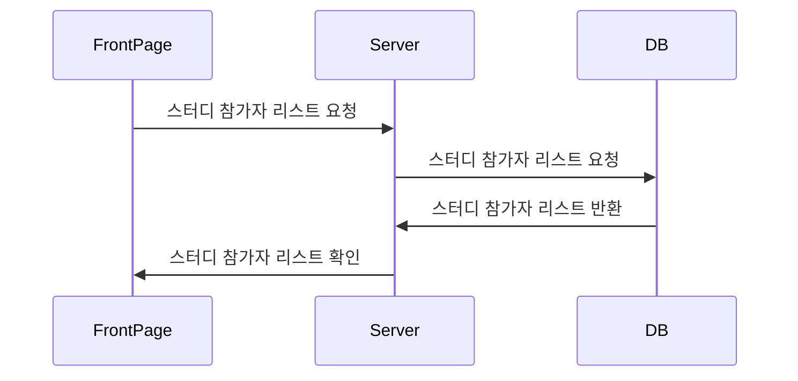

## 7. 스터디 방 채팅

스터디 방 입장 후 스터디 정보를 확인한다.

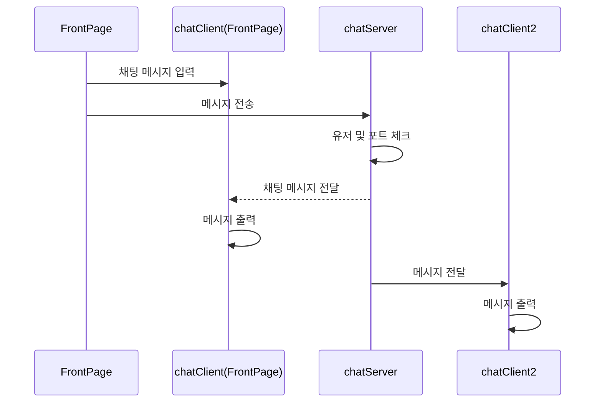

## 8. 스터디 방 캘린더 기능

스터디 방 입장 후 일정을 확인한다.

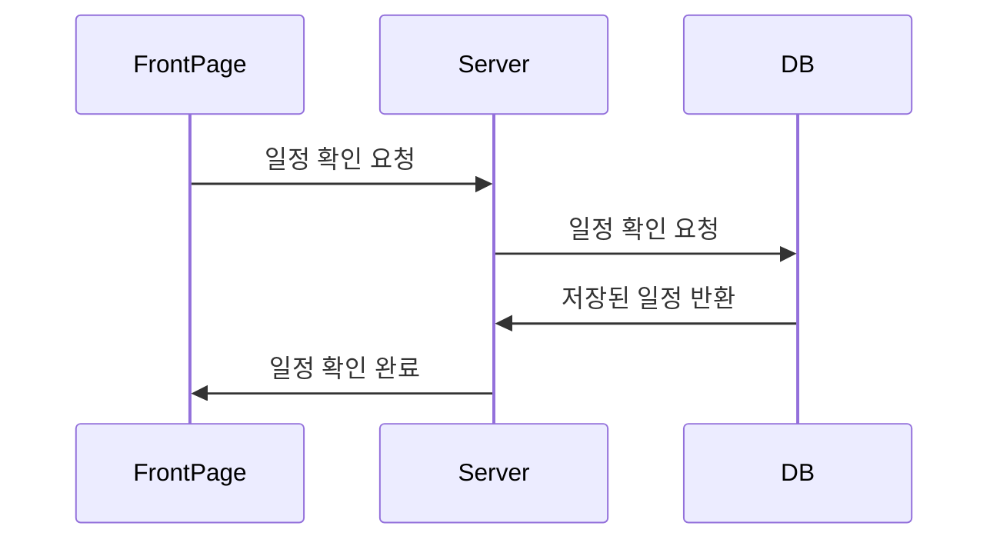

## 9. 스터디 방 일정 추가

스터디 방 입장 후 일정을 추가한다.

## 10. 스터디 방 토마토 저장

스터디 방 입장 후 뽀모도로 기능 사용

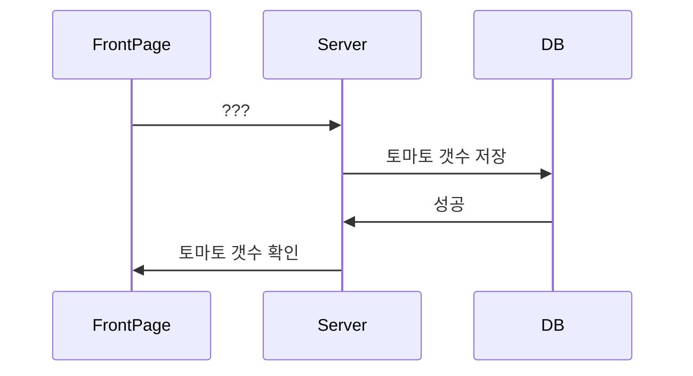

## 11. 이름으로 스터디 찾기

사용자가 원하는 스터디를 검색한다.

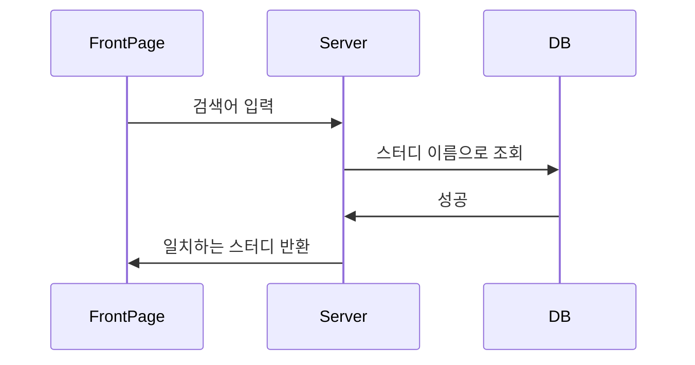

## 12. 테마별 스터디 찾기

사용자가 원하는 스터디를 검색한다.

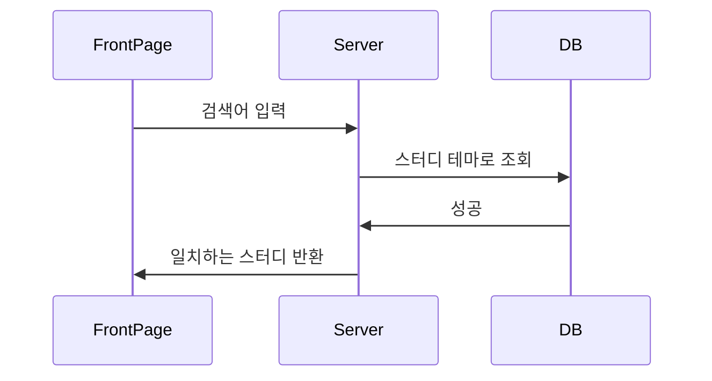

## 13. 스터디 만들기

사용자가 스터디를 만든다.

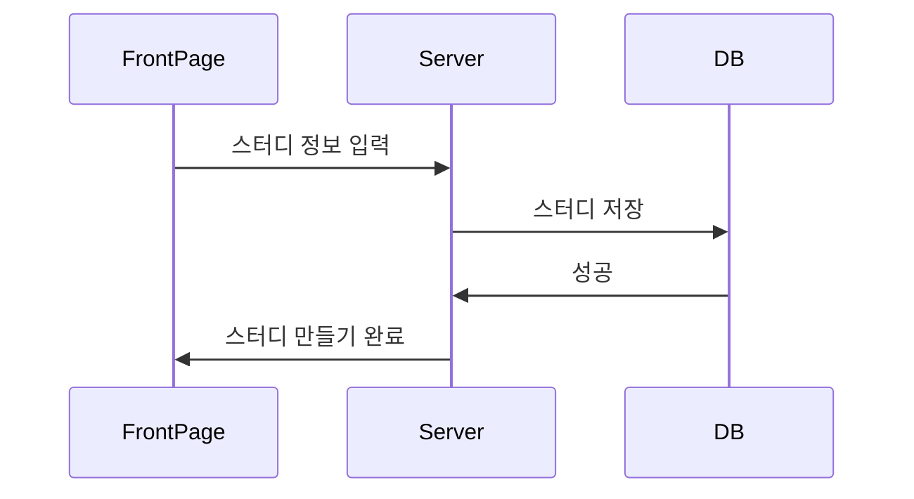

## 14. 스터디 정보 수정

스터디 정보를 수정한다.

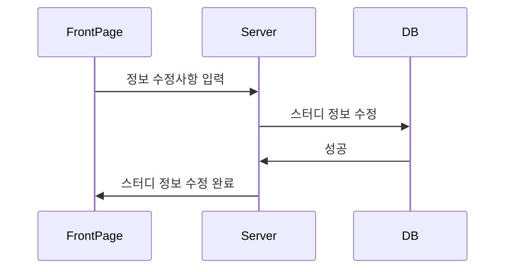

## 15. 스터디 댓글 입력

사용자가 스터디세부 페이지에서 댓글을 입력한다.

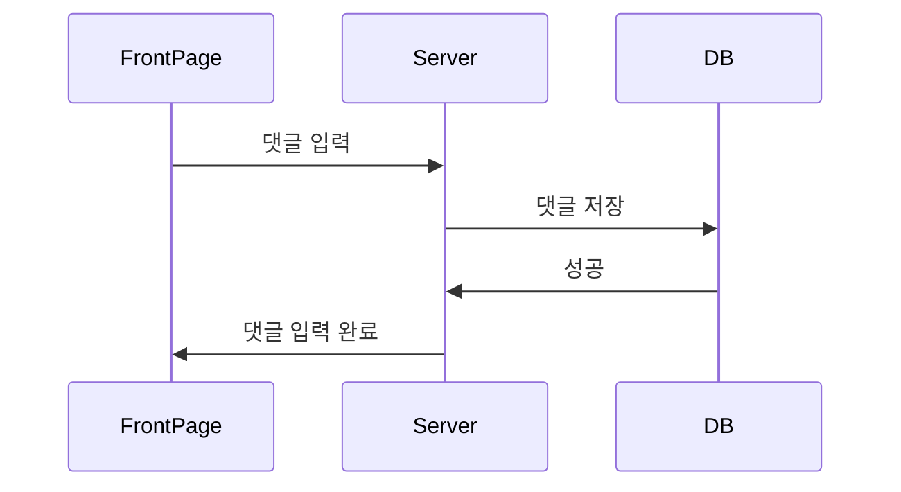

## 16. 스터디 댓글 불러오기

스터디 세부 페이지에서 댓글을 확인한다.

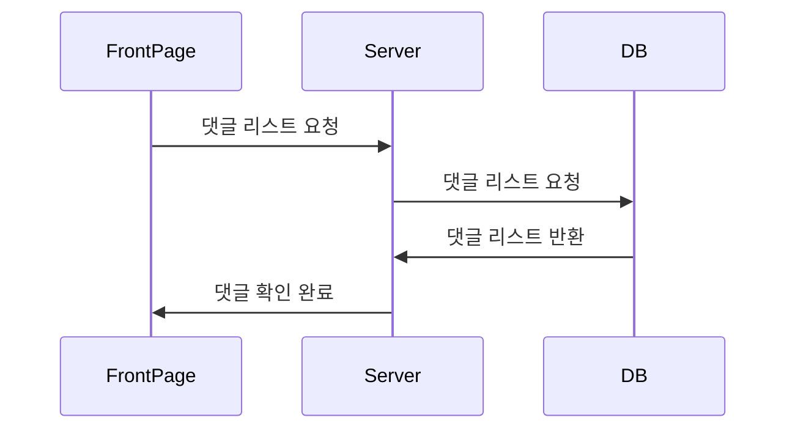

